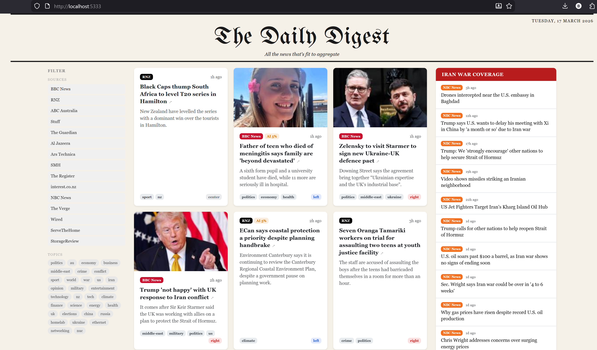

# The Daily Digest

A self-hosted news aggregator that displays articles in a classic newspaper layout, with AI-powered political bias classification. Runs entirely in Docker — no local Node.js or Python required.



---

## Features

- **Newspaper front page** — UnifrakturMaguntia masthead, Bootstrap grid layout, breaking news banner, doom-scroll break
- **RSS ingestion** — crawls 15 pre-seeded sources every 2 minutes; scrapes full article content via cheerio; falls back to archive.ph / Wayback Machine for paywalled content; video stream URLs are rejected at parse time so only real images are stored
- **Bias + topic classification** — local Ollama LLM (`llama3.2`) tags each article with a political bias (left → right) and a set of topic tags drawn from the article's full body text (up to 4,000 chars); falls back to Claude Haiku if Ollama is unavailable; batches of 50 at concurrency 5 every 5 seconds
- **AI writing trope detector** — pure regex scorer (22 pattern categories) detects AI-generated writing signatures in every article; score displayed as a colour-coded badge on article cards (amber < 10%, orange 10–25%, red ≥ 25%); runs entirely client-side with no LLM dependency
- **Configurable classifier tags** — manage the topic tag vocabulary from the admin panel; changes take effect on the next batch without a restart
- **Filter panel** — left sidebar lets readers filter by source and/or topic tag; selections persist when navigating between archive days via URL query params
- **Iran conflict sidebar** — right sidebar surfaces the latest Iran war coverage on every page (front page and day archive)
- **Image proxy** — `GET /api/image?url=` proxies external images with SSRF protection and content-type allow-listing
- **Historical archive** — browse any past day at `/day/YYYY-MM-DD`
- **Admin panel** — manage sources; trigger on-demand crawls; monitor crawler status; manage topic tags; manage users; view ingestion stats
- **User auth** — register/login; first registered user is automatically admin; bcrypt password hashing; HTTP-only session cookies
- **Security** — SSRF protection on all outbound fetches, content sanitisation, nginx rate limiting with local-IP exemption, strict CSP headers

---

## Stack

| Layer | Technology |
|---|---|
| Web app | Next.js 14 (App Router, TypeScript, Bootstrap 5 + Tailwind CSS) |
| Database | PostgreSQL 16 |
| Ingestion worker | Node.js 20 + TypeScript |
| Classifier worker | Node.js 20 + TypeScript |
| LLM | Ollama (`llama3.2`) with Claude Haiku fallback |
| Reverse proxy | nginx Alpine |
| Containerisation | Docker Compose v2 |

---

## Project Structure

```
news/
├── docker-compose.yml          # All 6 services
├── .env.example                # Configuration template
├── db/
│   └── init.sql                # Schema + 15 pre-seeded news sources
├── nginx/
│   ├── nginx.conf              # Rate limiting (geo block exempts local IPs), reverse proxy
│   └── security-headers.conf  # CSP, X-Frame-Options, etc.
├── ingestion/                  # RSS crawler worker
│   └── src/
│       ├── index.ts            # Entry point, DB retry loop
│       ├── scheduler.ts        # Cron every 2 min, max 5 concurrent sources
│       ├── crawler.ts          # Main crawl logic per source
│       ├── feeds.ts            # RSS parsing; filters video stream URLs from image fields
│       ├── scraper.ts          # Cheerio-based article scraping
│       ├── archive.ts          # archive.ph / Wayback Machine fallback
│       ├── discovery.ts        # Auto-detect RSS URL for a domain
│       ├── fetcher.ts          # SSRF-safe HTTP fetch wrapper
│       ├── security.ts         # URL validation, rate limiter
│       ├── sanitize.ts         # HTML sanitisation
│       └── db.ts               # pg Pool singleton
├── classifier/                 # Bias + topic classification worker
│   └── src/
│       ├── index.ts            # Polls every 5s; batch 50; concurrency 5
│       ├── bias.ts             # Ollama → Claude Haiku fallback
│       └── tropes.ts           # Regex-based AI writing trope scorer (22 categories)
├── web/                        # Next.js application
│   └── src/
│       ├── app/
│       │   ├── page.tsx                    # Home page (today's articles)
│       │   ├── HomeClient.tsx              # Filter state + URL sync; wraps layout
│       │   ├── FilterPanel.tsx             # Left sidebar: filter by source + topic tag
│       │   ├── FrontPageClient.tsx         # Load-more, scroll-break, filter-aware day nav
│       │   ├── day/[date]/page.tsx         # Historical archive view
│       │   ├── login/page.tsx              # Login / register
│       │   ├── admin/
│       │   │   ├── layout.tsx              # Auth guard (redirects non-admin)
│       │   │   ├── page.tsx                # Dashboard (stats, recent jobs)
│       │   │   ├── classifier/             # Classifier tag management + reclassify-all
│       │   │   ├── sources/                # Source management CRUD
│       │   │   ├── crawlers/               # Crawler status + controls
│       │   │   ├── stats/                  # Ingestion statistics
│       │   │   └── users/                  # User management
│       │   ├── api/
│       │   │   ├── auth/{login,register,logout,me}/
│       │   │   ├── articles/               # GET with date/page/limit/sources/tags params
│       │   │   ├── image/                  # Image proxy (SSRF-safe, content-type allow-list)
│       │   │   ├── admin/{reclassify,settings}/  # Classifier admin endpoints
│       │   │   ├── sources/                # CRUD + discover + crawl-now
│       │   │   ├── users/                  # User management
│       │   │   └── crawlers/{status,crawl-all}/
│       │   └── components/
│       │       ├── Masthead.tsx
│       │       ├── ArticleCard.tsx         # lead / secondary / brief variants; source, AI-gauge & bias badges
│       │       ├── IranSidebar.tsx         # Iran conflict right sidebar
│       │       └── SourceBadge.tsx
│       └── lib/
│           ├── db.ts                       # pg Pool with hot-reload guard
│           └── auth.ts                     # Session helpers
└── data/                       # Docker volume bind mounts (git-ignored)
    ├── postgres/
    ├── cache/
    ├── ollama/
    └── logs/
```

---

## Getting Started

### Prerequisites

- Docker Engine 24+ and Docker Compose v2
- A Claude API key (optional — only used if Ollama is unavailable)

### 1. Clone and configure

```bash
git clone <your-repo-url> news
cd news
cp .env.example .env
```

Edit `.env` and fill in the required values:

```bash
# Required
POSTGRES_PASSWORD=changeme          # Choose a strong password
SESSION_SECRET=$(openssl rand -hex 32)

# Optional — only needed if Ollama is unavailable or you want Claude fallback
CLAUDE_API_KEY=sk-ant-...
```

### 2. Build

```bash
docker compose build
```

### 3. Start

```bash
docker compose up -d
```

The first run will:
1. Initialise the PostgreSQL database with the schema and all 15 source seeds
2. Pull the `llama3.2` model into Ollama (this may take a few minutes on first start)
3. Start the ingestion scheduler — first crawl begins within 2 minutes

### 4. Create your admin account

Go to [http://localhost:5333/login](http://localhost:5333/login) and click the **Register** tab (next to Sign in). The first account created automatically receives the `admin` role.

### 5. Access the admin panel

Go to [http://localhost:5333/admin](http://localhost:5333/admin). From here you can:
- View ingestion stats and recent crawl jobs
- Add, edit, or remove news sources
- Trigger an immediate crawl of any source (or all sources at once)
- Monitor crawler status per source
- Manage classifier topic tags and trigger a full reclassification of all articles
- Manage user accounts

---

## Configuration Reference

All configuration is via environment variables in `.env`:

| Variable | Default | Description |
|---|---|---|
| `POSTGRES_DB` | `newsdb` | Database name |
| `POSTGRES_USER` | `newsuser` | Database user |
| `POSTGRES_PASSWORD` | — | **Required.** Database password |
| `SESSION_SECRET` | — | **Required.** 32+ random bytes for session signing |
| `CLAUDE_API_KEY` | — | Claude Haiku API key (bias classifier fallback) |
| `OLLAMA_HOST` | `http://ollama:11434` | Ollama API base URL |
| `OLLAMA_MODEL` | `llama3.2` | Model to use for bias classification |
| `MAX_ARTICLE_AGE_DAYS` | `7` | Skip articles older than this many days |
| `CRAWL_TIMEOUT_MS` | `30000` | Per-request timeout for the ingestion worker |
| `CRAWL_MAX_BYTES` | `10485760` | Max response size (10 MB default) |

---

## Pre-seeded Sources

The following sources are seeded into the database on first run and will begin crawling immediately:

| Source | Category | Bias |
|---|---|---|
| BBC News | General | Center |
| The Guardian | General | Center-left |
| RNZ | General | Center |
| Stuff | General | Center |
| ABC Australia | General | Center |
| SMH | General | Center |
| Al Jazeera | General | Center |
| NBC News | General | Center |
| interest.co.nz | Business | Center |
| Ars Technica | Tech | Center |
| The Register | Tech | Center |
| The Verge | Tech | Center-left |
| Wired | Tech | Center-left |
| ServeTheHome | Homelab | Center |
| StorageReview | Homelab | Center |

Additional sources can be added via the admin panel. The **Auto-detect** button will probe a domain for its RSS feed URL automatically.

---

## Docker Services

| Service | Port (internal) | Description |
|---|---|---|
| `nginx` | 5333 (host) | Reverse proxy, rate limiting, security headers |
| `web` | 3000 | Next.js application |
| `postgres` | 5432 | Database |
| `ingestion` | — | RSS crawler (no exposed port) |
| `classifier` | — | Bias tagger (no exposed port) |
| `ollama` | 11434 | Local LLM server |

**Network isolation:** `ingestion` is the only service with outbound internet access. The `postgres`, `classifier`, and `ollama` services are on an internal-only network with no external routing.

---

## Useful Commands

```bash
# Start everything
docker compose up -d

# View logs
docker compose logs -f web
docker compose logs -f ingestion
docker compose logs -f classifier

# Stop everything
docker compose down

# Stop and wipe the database (destructive)
docker compose down -v

# Rebuild a single service after code changes
docker compose build web && docker compose up -d web

# Connect to the database directly
docker compose exec postgres psql -U newsuser -d newsdb

# Force an immediate crawl of all sources (also available in the admin UI)
curl -X POST http://localhost:5333/api/crawlers/crawl-all \
  -H "Cookie: news_session=<your-session-token>"
```

---

## How It Works

### Ingestion pipeline

1. The **scheduler** runs every 2 minutes and picks up to 5 sources whose `next_crawl` time has passed.
2. For each source, the **crawler** fetches the RSS feed, filters out articles older than `MAX_ARTICLE_AGE_DAYS`, and deduplicates by URL hash.
3. For articles with thin RSS content, it scrapes the full page with **cheerio** to extract body text and images.
4. If the article is paywalled or the scrape fails, it tries **archive.ph** then the **Wayback Machine**.
5. Each article is inserted into PostgreSQL with `classified = false`.

### Classification pipeline

1. The **classifier** polls every 5 seconds for unclassified articles in batches of 50, running up to 5 articles concurrently.
2. It sends the article title and up to 4,000 characters of body content (falling back to summary, then title) to **Ollama** (`llama3.2`) with a prompt requesting a political bias tag and a list of matching topic tags.
3. Topic tags are loaded from the `app_settings` table (editable via the admin panel) and fall back to a built-in default set.
4. If Ollama is unavailable, it falls back to **Claude Haiku** via the Anthropic API.
5. In parallel, the **trope scorer** runs 22 regex pattern categories over the same text to produce a `trope_score` (0–100). This step requires no network calls and always succeeds.
6. The `bias_tag`, `content_tags`, and `trope_score` columns are updated and `classified` is set to `true`.

### Authentication

- Passwords are hashed with **bcrypt** (cost factor 12).
- Sessions are stored in the `sessions` PostgreSQL table as random tokens; the token is sent as an **HTTP-only cookie**.
- The first user to register is automatically granted the `admin` role.
- Session expiry is 24 hours.

---

## Security Notes

- All outbound HTTP requests go through `assertSafeUrl()` which blocks requests to private/loopback IP ranges (SSRF protection).
- Article HTML is sanitised through an allowlist before storage.
- nginx enforces rate limits: 5 requests/min on auth endpoints, 30/min on the API.
- A strict Content Security Policy blocks inline scripts and external resources.
- The database and LLM services have no internet access (internal Docker network only).
